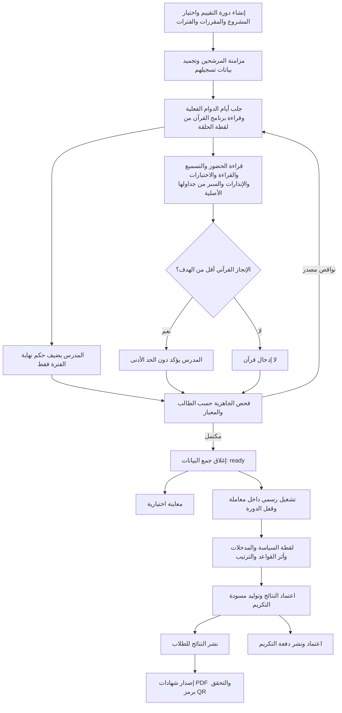

# المرجع التنفيذي لنظام التقييم النهائي والنتائج والشهادات

**المشروع:** QIMS  
**تاريخ توثيق النسخة:** 2026-07-29  
**مرجع المتطلبات:** `howitworks.pdf`، ولا سيما بنود الدورة والتقييم العام والتكريم، مع مراعاة توضيحات صاحب المشروع.

## 1. الغرض والنطاق

يوثق هذا المرجع الميزة المنفذة كاملةً، بدءًا من تثبيت المرشحين وجمع بيانات الحضور والتقييمات، وانتهاءً بالاحتساب الرسمي والاعتماد والنشر والتكريم وإصدار الشهادات والتحقق منها.

صُممت الميزة على خمسة مبادئ:

1. **مرونة القواعد:** تحفظ كل دورة تقييم نسخةً محددة من سياسة حساب ذات إصدار، ولا تعتمد النتائج القديمة على الإعدادات الحالية بعد تغييرها.
2. **قابلية التتبع:** تحفظ النتيجة مدخلات كل معيار وأثر القاعدة التي أنتجتها، إضافة إلى سجل تدقيق للتعديلات والإجراءات الحساسة.
3. **فصل الأدوار:** يفصل النظام بين جمع البيانات، والاحتساب، والاعتماد، والنشر، وإصدار الشهادات.
4. **حماية الطالب:** لا يرسل الطالب رقم طالب إلى واجهات النتائج؛ تُستخرج هويته من رمز الدخول، ولا يرى إلا نتائجه المنشورة وشهاداته السارية.
5. **المصدر مرة واحدة:** لا تنشئ شاشة التقييم نسخة ثانية من الحضور أو التسميع أو القراءة أو الاختبار أو الإنذار أو السبر؛ تقرأ السجل التشغيلي نفسه وتثبت معرفه في أثر النتيجة.

لا يستبدل النظام مصادر البيانات اليومية القائمة، مثل الحضور والسبر والمواد والحلقات. بل يربطها بدورة تقييم محددة، يتحقق من اكتمالها، ثم يبني منها لقطة نتيجة غير قابلة للتأثر بتعديلات لاحقة.

## 2. القرارات المعتمدة وحسم التعارضات

### 2.1 تقييم المدرس والمجموع الأعظمي

اعتمد تقييم المدرس من **50 درجة** وفق التفصيل الصريح في المرجع:

- السلوك ضمن الحلقة: 20.
- المشاركة الفعالة والواجبات: 20.
- رأي المدرس: 10.

ورد في فقرة المجموع العام رقم 65 لمعيار «تقييم الطالب العلمي والسلوكي»، مع أن التفصيل السابق يساوي 50. وبناء على توضيح صاحب المشروع، اعتمد التفصيل الصريح 50. لذلك يكون المجموع الأساسي عند انطباق كل المعايير:

```text
الحضور 130
+ القراءة 25
+ القرآن 100
+ الاختبارات النظرية 100
+ تقييم المدرس 50
+ تقييم الإدارة 50
= 455 درجة أساسية
```

تضاف درجات السبر فوق 455. حُفظ القرار في `config/evaluation.php` وفي لقطة السياسة داخل كل تشغيل، فلا يوجد رقم 470 مخفي أو ثابت في خدمة الحساب.

### 2.2 برنامج القرآن ثابت على الحلقة

لا يصنف نظام التقييم كل جلسة إلى فقه أو تجويد أو غير ذلك؛ لأن هذا التفصيل لا يغير معادلة التقييم. عند إنشاء الحلقة أو تعديلها يحدد المستخدم `quran_mode` مرة واحدة:

- `recitation`: حلقة تسميع؛ هدف القرآن صفحة واحدة لكل يوم دوام فعلي.
- `talqin`: حلقة تلقين؛ هدف القرآن نصف صفحة لكل يوم دوام فعلي.
- `none`: دروس عامة بلا قرآن؛ معيار القرآن غير منطبق.

تبقى المواد والدروس المرتبطة بكل تاريخ في نظام المنهج لتوضيح ما دُرّس، لكنها ليست تصنيفًا حسابيًا في التقييم. عند مزامنة المرشحين يحفظ النظام `quran_mode_snapshot` داخل لقطة تسجيل الطالب، حتى لا تغير تعديلات الحلقة اللاحقة نتيجة دورة قديمة.

### 2.3 الإنجاز القرآني دون الحد الأدنى

إذا كانت الصفحات المنجزة أقل من الهدف المحسوب، يجب على المدرس وضع الإشارة اليدوية **«دون الحد الأدنى»**. يرفض النظام إرسال تقييم ناقص الهدف من دون هذه الإشارة، كما يرفض وضع الإشارة عند بلوغ الهدف.

قرار الدرجة المعتمد:

- بلوغ الهدف: 70 درجة.
- كل صفحة فوق الهدف: درجة إضافية، حتى 100.
- أقل من الهدف مع الإشارة اليدوية: 0 في معيار القرآن.

يبقى عدد الصفحات الفعلي محفوظًا ويستخدم مستقلًا في شرط التفوق «نصف الهدف على الأقل». لذلك قد تكون درجة المعيار صفرًا بسبب عدم بلوغ الحد الأدنى الكامل، ومع ذلك يجتاز الطالب شرط نصف الكمية إن كان قد حقق نصف الهدف.

### 2.4 نجاح السبر

كل سجل سبر جزء موجود في المصدر الحالي يعامل على أنه سبر ناجح، وفق التوضيح المعتمد. لا يعاد منح نقاط الجزء نفسه للطالب مهما تكرر السبر، لأن جدول الإنجاز يفرض تفرد `(student_id, part_number)`.

### 2.5 الحضور الآلي

الحضور ليس إدخالًا يدويًا في شاشة التقييم. مصدر خارجي، مثل تطبيق الهاتف أو كاميرا التعرف على الوجه، يكتب السجل مباشرة في `student_course_absences`. لا تحتسب النتيجة الرسمية إذا وجدت جلسة محتسبة بلا سجل للطالب.

مصدر مقام الحضور هو سجل أيام الدوام الفعلية `course_dates` الذي أنشأه نظام المقرر مسبقًا. عند إنشاء المقرر تستبعد تواريخ العطل والاستثناءات أصلًا، ولذلك لا يعيد نظام التقييم إنشاء الأيام ولا يولد أيامًا من الفرق التقويمي بين تاريخين. إذا كان المقرر يحتوي 60 سجل دوام فعليًا داخل فترات التقييم، فمقام الحضور هو 60، سواء امتدت الفترات ستة أشهر أو أكثر.

### 2.6 توقيت بدء التقييم

التقييم عملية لاحقة لانتهاء التدريس، وليس أداة لإدارة الجدول اليومي. يمكن إعداد الدورة كمسودة، لكن يرفض النظام بدء حالة `data_collection` قبل انتهاء آخر فترة تقييم. وبذلك لا توجد في مساحة عمل التقييم جلسة تنتظر التحول من «مجدولة» إلى «منفذة»؛ فكل صف يعرضه التقييم يوم دوام فعلي مجهز مسبقًا.

### 2.7 أولوية مصادر البيانات وتقليل الإدخال

تعتمد النسخة الحالية المصادر الآتية مباشرة:

| المعيار | المصدر التشغيلي الرسمي | ما يطلبه التقييم يدويًا |
|---|---|---|
| الحضور | `student_course_absences` مع `course_dates` | لا شيء |
| تحسن القراءة | أحدث سجل مناسب في `reading_improvements` | لا شيء داخل شاشة التقييم؛ حكم التحسن يسجل مرة واحدة في سير القراءة الأصلي لأنه لا يمكن استنتاج جودة القراءة من الحضور أو العلامات |
| القرآن | `memorizations` المرتبط بالحَلقة والمقرر ويوم الدوام | تأكيد `below_minimum` فقط عندما تكون الصفحات المستخرجة أقل من الهدف، مع ملاحظة اختيارية |
| النظري | `exams.mark` و`subjects.max_marks` | لا شيء |
| المدرس | حكم مهني من 20 + 20 + 10، مع دليل آلي من الملاحظات والإنذارات والحضور | القيم الثلاث والتعليق الاختياري فقط |
| الإدارة | `warnings.deduction_points` | لا شيء في شاشة التقييم؛ مقدار الحسم 1–5 يثبت مرة واحدة عند إنشاء الإنذار |
| السبر | `sabrs` | لا شيء؛ كل جزء مسجل يعد ناجحًا وفق القرار المعتمد |

جدولا `evaluation_exam_results` و`administration_behavior_observations` محفوظان للتوافق مع البيانات التاريخية السابقة، لكن إنشاء سجلات جديدة لهما أزيل من مسارات التقييم، ولا يعد أولهما مصدرًا للاحتساب الحالي. الحسومات الإدارية القديمة المعتمدة فقط تبقى مقروءة حتى لا تضيع آثار سابقة.

## 3. المصطلحات

- **سياسة التقييم:** كائن ذو إصدار يحتوي كل الأوزان والحدود والمعادلات.
- **دورة التقييم:** الإطار الذي يجمع مشروعًا، مقررات، مدة، موسمًا، وفترات تقييم.
- **فترة التقييم:** جزء مرتب داخل الدورة، مثل الشتاء الأولى والشتاء الثانية.
- **المرشح:** لقطة طالب مشارك في دورة التقييم.
- **تسجيل المرشح:** لقطة المقرر والحلقة والمدرس وقت المزامنة.
- **المعاينة:** تشغيل حسابي قابل للتكرار ولا ينشر نتيجة.
- **التشغيل الرسمي:** احتساب نهائي بعد اكتمال الجاهزية، مع وقت قطع بيانات.
- **النتيجة:** المحصلة الخاصة بمرشح داخل تشغيل واحد.
- **أثر القاعدة:** المدخلات والمعادلة والقرار الذي أنتج درجة معيار.
- **دفعة التكريم:** قائمة جوائز مشتقة من تشغيل نهائي معتمد.
- **الشهادة:** ملف PDF بإصدار ورقم تسلسلي ورمز تحقق وبصمة SHA-256.

## 4. سير العمل الكامل



### 4.1 إنشاء الدورة

يحدد المستخدم المخول:

- المشروع.
- اسم الدورة وموسمها.
- المقررات التابعة للمشروع.
- فترة واحدة أو أكثر بترتيب وتواريخ غير متداخلة.
- عدد الأوائل، وافتراضيًا 15.

لا يدخل المستخدم بداية الدورة ونهايتها مرتين. يشتق النظام بداية الدورة من أقدم `start_date` للفترات ونهايتها من أحدث `end_date`، ويحفظ القيمتين المشتقتين للاستعلام والتقارير والشهادات. تمثل تواريخ الفترات نوافذ ربط وفصل بين التقييمات، ولا تستخدم لتوليد أيام حضور تقويمية.

تختار الخدمة أحدث سياسة مطابقة للإعداد الافتراضي أو تنشئ إصدارًا معتمدًا جديدًا إذا تغيرت الإعدادات.

### 4.2 مزامنة المرشحين

تجلب المزامنة الطلاب المسجلين في حلقات المقررات المختارة، وتثبت:

- المسجد.
- الصف الدراسي ومستوى القراءة.
- المقرر والحلقة والمدرس وأسماؤهم وقت المزامنة.

الغرض من اللقطة هو منع تغيير نتيجة تاريخية إذا نقل الطالب لاحقًا إلى حلقة أخرى أو تغير اسم المقرر أو المدرس.

### 4.3 ربط أيام الدوام ببرنامج الحلقة

يجلب النظام لكل مقرر سجلات `course_dates` الفعلية الواقعة داخل فترات التقييم والحاملة `counts_for_attendance = true`. هذه الأيام هي مقام الحضور، وهي نفسها عدد الأيام الذي يضرب في معدل الحلقة عند حساب هدف القرآن.

لا توجد شاشة «أنواع الجلسات» ولا مسارات API لتصنيف كل تاريخ. نوع الدرس التفصيلي، مثل الفقه أو التجويد النظري، يبقى في المنهج والمواد ولا يدخل معادلة القرآن.

أمثلة:

- حلقة تسميع لها 60 يوم دوام فعلي: الهدف 60 صفحة.
- حلقة تلقين لها 60 يوم دوام فعلي: الهدف 30 صفحة.
- حلقة `none`: القرآن غير منطبق مهما كان عدد الأيام.

إذا عُدّل برنامج الحلقة بعد مزامنة الطلاب، يجب إعادة المزامنة ما دامت الدورة في `draft` أو `data_collection` لتحديث اللقطة. بعد إغلاق البيانات تبقى اللقطة ثابتة.

### 4.4 جمع المدخلات

- الحضور: يقرأ آليًا من النظام الخارجي.
- القراءة: تقرأ من سجل التحسن التشغيلي؛ لا يعاد إدخال القياس في التقييم.
- القرآن: تستخرج الصفحات الجديدة وصفحات المراجعة من `memorizations`. لا يظهر النموذج اليدوي إلا لتأكيد «دون الحد الأدنى».
- الامتحانات: تقرأ العلامة من `exams` والعظمى من `subjects`.
- تقييم المدرس: مرة لكل طالب/فترة/حلقة، وهو الحكم اليدوي المتكرر الوحيد.
- تقييم الإدارة: يبدأ من 50 وتخصم منه قيم الإنذارات المخزنة.
- السبر: يقرأ من `sabrs` مباشرة ويأخذ أول سجل تاريخي للطالب في كل جزء.

### 4.5 فحص الجاهزية

يعرض الفحص حالة كل معيار لكل طالب. تمنع النتيجة الرسمية إذا تحقق أي مما يأتي:

- لا توجد جلسات حضور محتسبة.
- توجد جلسة محتسبة بلا سجل حضور.
- لا يوجد سجل تحسن قراءة تشغيلي مناسب.
- إنجاز القرآن أقل من الهدف من دون إشارة «دون الحد الأدنى».
- توجد سجلات تسميع قديمة متعارضة لا يمكن نسبتها بأمان إلى حلقة واحدة.
- توجد مادة نظرية مطلوبة بلا نتيجة أو بدرجة عظمى غير صالحة.
- تقييم المدرس غير مكتمل لكل فترة مرتبطة.

المعيار غير المنطبق لا يمنع الجاهزية؛ مثال ذلك مقرر بلا مواد نظرية، أو طالب لا ينتمي إلى حلقة تسميع أو تلقين.

### 4.6 الاحتساب

المعاينة لا تغير حالة الدورة ويمكن تكرارها. أما التشغيل الرسمي:

1. يقفل سجل الدورة.
2. يتأكد أن الحالة `ready`.
3. يحدد `data_cutoff_at`.
4. يصالح إنجازات السبر التاريخية.
5. يعيد حساب جميع المرشحين داخل معاملة قاعدة بيانات واحدة.
6. يحفظ نسخة السياسة والجاهزية وكل درجات المعايير ومدخلاتها وآثار قواعدها.
7. يرتب المتفوقين ترتيبًا حتميًا.
8. ينقل الدورة إلى `calculated`.

بعد إغلاق جمع البيانات، ترفض خدمات الإدخال تعديل التقييمات. أي تصحيح يتطلب العودة من `ready` إلى `data_collection` قبل التشغيل الرسمي، أو سياسة تشغيل تصحيحية إدارية لاحقة بدل تعديل نتيجة منشورة.

### 4.7 الاعتماد والنشر

- الاعتماد مسموح لتشغيل رسمي مكتمل فقط.
- الاعتماد ينقل النتائج إلى `approved` والدورة إلى `approved` ويولّد مسودة التكريم.
- النشر مسموح بعد الاعتماد فقط.
- النشر ينقل النتائج والدورة إلى `published`.
- الطالب لا يرى نتيجة في حالة `preview` أو `calculated` أو `approved`.

### 4.8 الشهادة والتكريم

لا تصدر الشهادة إلا لنتيجة منشورة. التكريم له اعتماد ونشر منفصلان حتى يمكن للإدارة مراجعة قائمة الجوائز قبل إعلانها.

## 5. خريطة قواعد المرجع إلى التنفيذ

| قاعدة المرجع | القرار التنفيذي | موضع التنفيذ |
|---|---|---|
| أيام العطل أو إيقاف الدوام لا تحسب | نظام المقرر لا ينشئها ضمن أيام الدوام الفعلية، والتقييم لا يولد تواريخ بديلة | `CourseDateService` و`EvaluationSessionService` |
| مقام الحضور هو الأيام الفعلية فقط | كل سجل `course_dates` محتسب داخل إحدى الفترات يدخل مرة واحدة؛ لا يعتمد الحساب على فرق تاريخي البداية والنهاية | `EvaluationSessionService` و`AttendanceCalculator` |
| الحضور من أول يوم محتسب لا من يوم تسجيل الطالب | جميع أيام الدوام الفعلية لمقررات المرشح داخل الفترات تدخل في المقام | `AttendanceCalculator` |
| الغياب بإذن نصف يوم | وزن الغياب المأذون 0.5 | سياسة الحضور |
| كل 6 تأخيرات فترة أولى = غياب | `floor(first_period_late / 6)` | `AttendanceCalculator` |
| كل 4 تأخيرات فترة ثانية = غياب | `floor(second_period_late / 4)` | `AttendanceCalculator` |
| أقل من 60% = صفر | بوابة الدرجة في نمط الناشئة | سياسة الحضور |
| من 60 إلى أقل من 90 = النسبة | الدرجة تساوي النسبة | سياسة الحضور |
| 90 فأكثر، 3 درجات لكل 1% فوق 90 | `p + 3 × (p - 90)`، سقف 130 | سياسة الحضور |
| زدني علمًا نسبة طبيعية | نمط سياسة بديل `percentage` وسقفه 100 | سياسة الحضور |
| التحسن المعتبر +25 | نوع `significant_improvement` | سياسة القراءة |
| التحسن البسيط +10 | نوع `slight_improvement` | سياسة القراءة |
| عدم التحسن -5 | نوع `no_improvement` | سياسة القراءة |
| التراجع -15 | نوع `decline` | سياسة القراءة |
| المستوى الأول: بسيط 2 ومعتبر 4 | يصنفه سير القراءة الأصلي ويحفظ النتيجة مرة واحدة | `reading_improvements` |
| المستوى الثاني: بسيط 1.5 ومعتبر 3 | يحفظ النوع والقياسين والفرق إن توفرت | `reading_improvements` |
| المستوى الثالث: النتيجة أقل من 7 تراجع | يقرأ التقييم التصنيف المخزن ولا يطلب إدخاله ثانية | `ReadingCalculator` |
| نتيجة فوق 8 توصي بالانتقال | `promotion_recommended` محفوظ في سجل القراءة | `reading_improvements` |
| معيار القرآن خاص بالحلقات المنطبقة | التطبيق مشتق من `quran_mode_snapshot` لا من نوع كل جلسة | تسجيل المرشح و`QuranCalculator` |
| حلقة التسميع: صفحة في اليوم | `recitation = 1` | سياسة القرآن |
| حلقة التلقين: نصف صفحة في اليوم | `talqin = 0.5` | سياسة القرآن |
| الدروس العامة بلا قرآن | `none` يجعل المعيار غير منطبق | `QuranCalculator` |
| الهدف الأدنى يعطي 70 | `target_reached_score = 70` | `QuranCalculator` |
| كل صفحة إضافية درجة حتى 100 | `min(100, 70 + extra_pages)` | `QuranCalculator` |
| المراجعة المستمرة للمحفوظ | كل سجل `record_type=revision` يحسب ويظهر في أثر النتيجة | `memorizations` |
| العلوم الشرعية والتجويد النظري والآداب من 100 | توحيد موزون إلى 100 | `TheoreticalExamCalculator` |
| المادة لها درجة دنيا وعظمى وقد تشترك مع مادة | العلامة من `exams` والعظمى من `subjects.max_marks` والعلاقة بالمقرر | `EvaluationSourceService` |
| تقييم المدرس 20 + 20 + 10 | مجموع 50 لكل فترة ثم متوسط الفترات | `TeacherEvaluationCalculator` |
| سبر المعهد الناجح +25 لكل جزء | أول سجل تاريخي داخلي للطالب في الجزء | `sabrs` و`SabrBonusCalculator` |
| سبر الأوقاف الناجح +40 لكل جزء | أول سجل تاريخي أوقاف للطالب في الجزء | المصدر والحاسب نفسيهما |
| لا تتكرر درجة الجزء | ترتيب كل سجلات الطالب زمنيًا واختيار أول ظهور فقط، مع لقطة إنجاز مساندة في التشغيل الرسمي | `SabrBonusCalculator` و`sabr_part_achievements` |
| تقييم الإدارة يبدأ من 50 | الدرجة `50 - مجموع warnings.deduction_points` وبحد أدنى صفر | `AdministrationEvaluationCalculator` |
| الحسم على الإنذار من 1 إلى 5 | يتحقق عند إنشاء الإنذار ويخزن مرة واحدة | `StoreWarningRequest` و`warnings` |
| الملاحظة داخل المسجد أو خارجه وفي كل الأنشطة | الإنذار مرتبط بالطالب لا بنوع درس؛ لا يحتاج تصنيف فقه/تجويد | `warnings` |
| الحضور لا يقل عن 60% للتفوق | شرط مانع صلب | `ExcellenceEvaluator` |
| محصلة المواد النظرية لا تقل عن 50% | شرط مانع صلب إن كان المعيار منطبقًا | `ExcellenceEvaluator` |
| عدم التراجع في القراءة | شرط مرن | `ExcellenceEvaluator` |
| القرآن نصف الهدف على الأقل | شرط مرن للمعيار المنطبق | `ExcellenceEvaluator` |
| تقييم المدرس 20 على الأقل | شرط مرن | `ExcellenceEvaluator` |
| تقييم الإدارة 20 على الأقل | شرط مرن | `ExcellenceEvaluator` |
| الإخفاق في الحضور أو النظري يخرج من التفوق | أي إخفاق صلب يجعل `is_excellent=false` | `ExcellenceEvaluator` |
| اجتماع إخفاقين من الشروط الأربعة الأخرى يخرج من التفوق | يسمح بإخفاق مرن واحد فقط | `maximum_failed_soft_requirements = 1` |
| تكريم الشتاء بعد الفترة الثانية | يمنع توليد تكريم شتوي إذا لم توجد الفترة ذات التسلسل 2 | `RecognitionService` |
| تكريم الصيف ضمن التكريم المركزي | دورة الموسم الصيفي تنتج دفعة مستقلة قابلة للاعتماد والنشر | دفعات التكريم |
| أفضل 15 طالبًا | يؤخذ العدد من الدورة، وافتراضيًا 15 | `RecognitionService` |
| جوائز رمزية للحضور 100% وللسبر | جائزتا `perfect_attendance` و`sabr_success` | `recognition_awards` |
| لا تكرر الهدية المادية لمن هو ضمن الأوائل | تحفظ الجائزة الرمزية وتلغى ماديتها مع سبب | `receives_material_gift` و`suppression_reason` |
| الأول والثاني والثالث جوائز مميزة | طبقات `first`, `second`, `third` | `RecognitionService` |
| المراكز 4–15 الجائزة نفسها | طبقة `top_group` | `RecognitionService` |
| الصلاحيات تختلف بين المشرفين | إذن صريح بالإضافة إلى نطاق المشروع/المقرر/الحلقة | المسارات و`EvaluationAccessService` |
| بيانات الطالب الأساسية ومستوى القراءة | تحفظ لقطة الصف والمستوى ورقم الطالب | المرشح والشهادة |
| إثبات سبر الأوقاف | يدعم مرجع إثبات، ويحفظ ارتباط سجل السبر | `evidence_reference` و`sabr_id` |

## 6. معادلات الحساب

### 6.1 الحضور

```text
الغياب المكافئ =
    الغياب غير المأذون
  + 0.5 × الغياب المأذون
  + floor(تأخير الفترة الأولى ÷ 6)
  + floor(تأخير الفترة الثانية ÷ 4)

نسبة الحضور =
  max(0, min(100, (عدد الجلسات - الغياب المكافئ) ÷ عدد الجلسات × 100))
```

`عدد الجلسات` هنا هو عدد سجلات `course_dates` الفعلية المحتسبة لمقررات المرشح والواقعة داخل إحدى فترات التقييم. لا يمثل عدد الأيام التقويمية بين أول الفترة وآخرها، ولا يتأثر بتاريخ تسجيل الطالب، ولا يقرأ حالة الجلسة. تحفظ النتيجة الرسمية معرفات هذه الجلسات في `rule_trace.session_ids` كي يمكن تدقيق المقام الذي استخدمته النتيجة لاحقًا.

في نمط الناشئة:

```text
إذا p < 60       => 0
إذا 60 <= p < 90 => p
إذا p >= 90      => min(130, p + 3 × (p - 90))
```

أمثلة:

- حضور 79% يعطي 79.
- حضور 98% يعطي `98 + 3×8 = 122`.
- حضور 100% يعطي 130.

في نمط النسبة الطبيعية، الدرجة تساوي نسبة الحضور من 100 بلا منحنى إضافي.

### 6.2 القراءة

يحسب الفرق:

```text
difference = final_score - baseline_score
```

يجري هذا القياس في سير متابعة القراءة الأصلي، لأن جودة القراءة لا يمكن اشتقاقها بأمان من الحضور أو الامتحانات. تحفظ القيم الأصلية والفرق ونوع التحسن والنقاط وتوصية الانتقال في `reading_improvements`. يأخذ التقييم أحدث سجل مناسب للمقرر ونافذة الدورة، ويطبق نقاط نسخة السياسة عليه من دون نموذج إدخال ثانٍ.

### 6.3 القرآن

```text
حلقة التسميع:
  الهدف = عدد أيام الدوام الفعلية في الفترة × 1 صفحة

حلقة التلقين:
  الهدف = عدد أيام الدوام الفعلية في الفترة × 0.5 صفحة

حلقة الدروس العامة بلا قرآن:
  المعيار غير منطبق
```

يستخدم الحساب `quran_mode_snapshot` المثبت عند مزامنة تسجيل الطالب، ولا يقرأ نوع الدرس أو حالة جلسة مستقلة. يأتي الإنجاز من صفحات `memorizations` الفريدة، وتأتي المراجعة من السجلات ذات `record_type=revision`. تحفظ قائمة معرفات أيام الدوام ومعرفات سجلات التسميع في أثر القاعدة.

### 6.4 الاختبارات

لكل مادة:

```text
النسبة = exams.mark / subjects.max_marks
```

ثم:

```text
درجة النظري = متوسط نسب المواد المطلوبة × 100
```

تشتق المواد المطلوبة من مواد مقررات الطالب إذا لم تحدد السياسة قائمة صريحة. الأوزان الحالية متساوية، ويمكن نقلها إلى السياسة مستقبلًا من دون تغيير مصدر العلامة. إذا لم توجد مواد أصلًا يصبح المعيار غير منطبق، ولا يعاقب الطالب على شيء غير مقدم له.

### 6.5 تقييم المدرس

```text
درجة الفترة = behavior + participation_homework + teacher_opinion
درجة الدورة = متوسط درجات الفترات المطلوبة
```

الحدود 20 و20 و10، ولا يقبل النظام قيمة تتجاوز حد بندها.

### 6.6 تقييم الإدارة

```text
درجة الإدارة = max(0, 50 - مجموع warnings.deduction_points)
```

كل إنذار تشغيلي يحمل حسمًا من 1 إلى 5. ولحماية التاريخ، تضاف أيضًا الحسومات القديمة المعتمدة وغير المعكوسة من `administration_behavior_observations` إن وجدت، لكن لا ينشئ نظام التقييم ملاحظات إدارية موازية جديدة.

### 6.7 النتيجة النهائية والنسبة

```text
base_score = مجموع درجات المعايير الأساسية المنطبقة
base_maximum = مجموع الحدود العظمى للمعايير الأساسية المنطبقة
bonus_score = مجموع نقاط السبر الجديدة
final_score = base_score + bonus_score
final_percentage = final_score / base_maximum × 100
```

قد تتجاوز النسبة النهائية 100 بسبب مكافآت السبر؛ لذلك تحفظ النقاط الإضافية منفصلة ولا تقص إلى 100.

### 6.8 الترتيب

يرتب الطلاب المتفوقون فقط وفق:

1. الدرجة النهائية تنازليًا.
2. نسبة الحضور تنازليًا عند التعادل.
3. درجة النظري تنازليًا.
4. رقم الطالب الداخلي تصاعديًا لضمان نتيجة حتمية.

غير المتفوق لا يمنح ترتيبًا ضمن قائمة الأوائل حتى إن كان مجموعه مرتفعًا.

## 7. نموذج البيانات

### 7.1 الإعداد والدورات

| الجدول | الغرض وأهم القيود |
|---|---|
| `evaluation_policies` | سياسة JSON ذات اسم وإصدار وحالة واعتماد؛ الاسم والإصدار فريدان |
| `evaluation_cycles` | مشروع وسياسة وموسم ونطاق تاريخي مشتق من الفترات وحالة وأوقات القطع والاعتماد والنشر |
| `evaluation_periods` | فترات مرتبة وغير متداخلة؛ التسلسل فريد داخل الدورة |
| `evaluation_cycle_courses` | ربط متعدد بين دورة التقييم والمقررات |
| `evaluation_candidates` | طالب واحد مرة واحدة لكل دورة مع لقطات المسجد والصف ومستوى القراءة |
| `evaluation_candidate_enrollments` | لقطة المقرر والحلقة والمدرس؛ قيد فريد مرشح/مقرر/حلقة |

### 7.2 مصادر البيانات والمدخلات

| الجدول | الغرض |
|---|---|
| `circles` | يضاف `quran_mode` لتحديد تسميع أو تلقين أو دروس عامة بلا قرآن مرة واحدة على مستوى الحلقة |
| `course_dates` | مصدر أيام الدوام الفعلية فقط؛ لا يحمل نوعًا خاصًا بحساب التقييم |
| `student_course_absences` | توسع بمرجع الجلسة والحلقة والإذن والمصدر والمرجع الخارجي ووقت الالتقاط والمسجل |
| `reading_improvements` | مصدر القراءة التشغيلي: النوع والقياسات والمستويات والفرق وتوصية الانتقال؛ يقرأه التقييم مباشرة |
| `memorizations` | مصدر الإنجاز والمراجعة؛ توسع بالمقرر والحلقة ويوم الدوام ونوع السجل ووقت التسجيل |
| `quran_period_assessments` | لا يكرر الصفحات؛ يخزن فقط تأكيد «دون الحد الأدنى» ولقطة الأرقام المستخرجة لأغراض التدقيق |
| `teacher_period_evaluations` | البنود الثلاثة والمجموع والدليل والتعليق لكل فترة/حلقة |
| `warnings` | مصدر تقييم الإدارة، مع `deduction_points` من 1 إلى 5 |
| `exams` و`subjects` | علامة الطالب والدرجة العظمى للمادة، وهما مصدر النظري الحالي |
| `sabrs` | مصدر مكافآت السبر مباشرة |
| `administration_behavior_observations` | توافق تاريخي للحسومات القديمة المعتمدة فقط؛ لا مسار إنشاء جديد في التقييم |
| `evaluation_exam_results` | سجل تاريخي من النسخة السابقة؛ غير مستخدم في الاحتساب الجديد |
| `sabr_part_achievements` | لقطة مساندة لأول نجاح تاريخي داخل التشغيل الرسمي، مع بقاء `sabrs` المصدر الأصلي |

يحمل `evaluation_candidate_enrollments.quran_mode_snapshot` نسخة برنامج الحلقة وقت المزامنة لحماية النتائج التاريخية.

### 7.3 المخرجات والتدقيق

| الجدول | الغرض |
|---|---|
| `evaluation_runs` | تشغيل مرقم، معاينة أو رسمي، مع لقطة السياسة والجاهزية |
| `evaluation_results` | مجاميع الطالب والتفوق والترتيب وحالة الاعتماد والنشر |
| `evaluation_criterion_results` | درجة كل معيار ومدخلاته وأثر قاعدته وتحذيراته |
| `recognition_batches` | مسودة/اعتماد/نشر قائمة تكريم مرتبطة بتشغيل |
| `recognition_awards` | نوع الجائزة وطبقتها وهل تستحق هدية مادية وسبب منع التكرار |
| `certificates` | إصدار ورقم تسلسلي ورمز تحقق مشفر ومسار وبصمة ولقطة بيانات وإلغاء |
| `evaluation_audit_events` | الحدث والفاعل والقيمة قبل/بعد والسياق وعنوان IP والوقت |

### 7.4 الفهارس والقيود المهمة

- جلسة/طالب فريدة في الحضور: تمنع تسجيلين متعارضين للجلسة نفسها.
- مصدر/مرجع خارجي فريد: يجعل إعادة إرسال حدث الكاميرا أو الهاتف آمنة.
- تسميع/طالب/جلسة/صفحة/نوع فريد: يسمح بتمييز الحفظ الجديد عن المراجعة ويمنع التكرار في الحدث نفسه.
- فهرس طالب/حلقة/وقت على التسميع لقراءة فترات التقييم بسرعة.
- فهرس طالب/وقت على الإنذارات لحساب الإدارة ضمن نافذة الدورة.
- طالب/جزء فريد في السبر: يمنع تكرار النقاط عبر الدورات.
- نتيجة مرشح فريدة داخل التشغيل.
- معيار فريد داخل النتيجة.
- رقم الشهادة ورمز تحققها فريدان.
- إصدار الشهادة فريد لكل نتيجة ونوع.
- فهارس على حالة الدورة، المرشح، الفترة، وقت الحدث، وحالات النشر لتسريع الشاشات والتقارير.
- سميت القيود والفهارس الطويلة صراحةً بأسماء أقصر من حد MySQL البالغ 64 محرفًا، بدل الاعتماد على الأسماء التلقائية المشتقة من أسماء الجداول الطويلة.

## 8. عقد نظام الحضور الخارجي

على تطبيق الهاتف أو الكاميرا كتابة سجل واحد لكل طالب في كل جلسة محتسبة، بما في ذلك الحاضر. الحقول:

| الحقل | القاعدة |
|---|---|
| `student` | معرف الطالب الصحيح |
| `course` | مقرر الجلسة |
| `course_date_id` | معرف الجلسة؛ هو المفتاح المفضل للربط |
| `circle_id` | الحلقة التي التقط منها الحضور |
| `type` | `present`, `full`, `first_period`, `second_period` |
| `is_excused` | يستخدم مع `full` لتمييز الغياب المأذون |
| `source` | مثال `camera` أو `mobile` |
| `external_reference` | معرف حدث ثابت وفريد داخل المصدر |
| `captured_at` | وقت الالتقاط الحقيقي |
| `date` | تاريخ متوافق لدعم السجلات القديمة |

قواعد التكامل:

1. يستخدم الكاتب عملية upsert أو يعالج تعارض المفتاح الفريد بوصفه إعادة إرسال، لا حدثًا جديدًا.
2. لا يكتب الكاتب درجات أو نسبًا؛ يكتب الواقعة الخام فقط.
3. إذا صحح سجلًا، يحافظ على المرجع الخارجي ويسجل التصحيح في سجل المصدر الخارجي.
4. لا يعد غياب السجل حضورًا؛ يعد نقص بيانات يمنع الاعتماد.
5. يجب أن تنشأ الجلسة في `course_dates` قبل وصول حدث الحضور.
6. يوصى بربط مستخدم قاعدة بيانات نظام الحضور بصلاحيات INSERT/UPDATE محدودة على جدول الحضور، بلا صلاحية على جداول النتائج أو السياسات أو الشهادات.
7. السجلات القديمة التي لا تحمل `course_date_id` تدعم مؤقتًا بالمفتاح `course + date`، لكن التكامل الجديد يجب أن يستخدم معرف الجلسة.
8. لا ينشئ نظام الحضور أو التقييم سجل `course_dates` لتاريخ عطلة؛ إنشاء الأيام الفعلية واستبعاد العطل مسؤولية نظام المقرر.

## 9. الخدمات الخلفية

- `EvaluationPolicyService`: إنشاء/قراءة السياسة ذات الإصدار.
- `EvaluationCycleService`: إنشاء الدورة، اشتقاق نطاقها من الفترات، منع البدء قبل انتهاء آخر فترة، والتحقق من انتقالات الحالة.
- `EvaluationSessionService`: المصدر الموحد لأيام الدوام المحتسبة داخل دورة التقييم أو فترة محددة.
- `EvaluationCandidateSyncService`: مزامنة المرشحين واللقطات.
- `EvaluationSourceService`: طبقة القراءة الموحدة للحفظ والمراجعة والقراءة والاختبارات والإنذارات ودليل المعلم، مع حل الروابط القديمة الآمنة وكشف السجلات الملتبسة.
- `EvaluationInputService`: يحفظ حكم المعلم وتأكيد القرآن فقط في المسارات الحالية، ويتحقق من السياق والنطاق والحدود مع التدقيق.
- حاسبات المعايير: كل معيار في صنف مستقل.
- `EvaluationCalculator`: تجميع المعايير والمجموع والنسبة والجاهزية.
- `ExcellenceEvaluator`: تطبيق الشروط الصلبة والمرنة.
- `SabrAchievementService`: مصالحة السبر التاريخي ومنع التكرار.
- `EvaluationRunService`: المعاينة والتشغيل الرسمي واللقطات والترتيب.
- `EvaluationWorkflowService`: الاعتماد والنشر.
- `RecognitionService`: إنشاء الجوائز وطبقاتها ومنع تكرار الهدية.
- `CertificateService`: الحجز الآمن للإصدار وتوليد PDF وQR والبصمة والإلغاء والتحقق.
- `EvaluationAuditService`: سجل موحد للأحداث قبل/بعد.
- `EvaluationAccessService`: نطاق الوصول حسب المشروع والمقرر والحلقة.

## 10. واجهات API

جميع مسارات الموظفين تستخدم Sanctum وقناة الويب، ثم صلاحية عربية صريحة وفحص نطاق داخل الخدمة.

### 10.1 الدورات

| الطريقة والمسار | الوظيفة |
|---|---|
| `GET /api/evaluation-cycles` | الدورات المرئية للمستخدم |
| `POST /api/evaluation-cycles` | إنشاء دورة |
| `GET /api/evaluation-cycles/{cycle}` | التفاصيل والمرشحون والتشغيلات |
| `POST /api/evaluation-cycles/{cycle}/sync-candidates` | مزامنة المرشحين |
| `GET /api/evaluation-cycles/{cycle}/readiness` | فحص الجاهزية |
| `PUT /api/evaluation-cycles/{cycle}/status` | انتقال الحالة |
| `POST /api/evaluation-cycles/{cycle}/runs` | معاينة أو تشغيل رسمي |
| `GET /api/evaluation-cycles/{cycle}/audit-events` | سجل التدقيق |

لا يقدم نطاق التقييم مسارات لتعديل أنواع الجلسات. يستقبل إنشاء الحلقة وتعديلها في واجهات الحلقات حقل `quran_mode` الإلزامي بإحدى القيم `recitation`, `talqin`, `none`.

### 10.2 المراجعة والمدخلات اليدوية الدنيا

| الطريقة والمسار | الوظيفة |
|---|---|
| `GET /api/evaluation-candidates/{candidate}/review` | جميع المعايير المحسوبة ومصادرها والنواقص والمدخلات اليدوية المطلوبة |
| `PUT /api/evaluation-candidates/{candidate}/teacher-evaluation` | حكم المدرس 20 + 20 + 10 وتعليق اختياري |
| `PUT /api/evaluation-candidates/{candidate}/quran-assessment` | تأكيد «دون الحد الأدنى» فقط؛ الصفحات والمراجعة لا يقبلهما الطلب |

لا توجد مسارات تقييم لإنشاء قراءة أو نتيجة امتحان أو ملاحظة إدارة موازية. تستمر واجهات التشغيل الأصلية للقراءة والامتحانات والإنذارات والتسميع، ومنها يأخذ المحرك القيم.

### 10.3 تطبيق المعلم المحمول

جميع المسارات التالية تستخدم رمز `mobile-access` وصلاحية عربية ونطاق المعلم:

| الطريقة والمسار | الوظيفة |
|---|---|
| `GET /api/mobile/teacher/evaluation-candidates` | قائمة مرشحي المعلم فقط، مع بحث وتصفية دورة وتقسيم صفحات |
| `GET /api/mobile/teacher/evaluation-candidates/{candidate}/review` | البيانات الآلية ودليل المعلم ومتطلبات الإدخال الخاصة بحلقاته |
| `PUT /api/mobile/teacher/evaluation-candidates/{candidate}/teacher-evaluation` | حفظ الحكم المهني |
| `PUT /api/mobile/teacher/evaluation-candidates/{candidate}/quran-assessment` | حفظ تأكيد النقص عند ظهوره |

### 10.4 النتائج والتكريم والشهادات

| الطريقة والمسار | الوظيفة |
|---|---|
| `GET /api/evaluation-runs/{run}` | تفاصيل التشغيل والنتائج |
| `POST /api/evaluation-runs/{run}/approve` | اعتماد النتائج وتوليد التكريم |
| `POST /api/evaluation-runs/{run}/publish` | نشر النتائج |
| `GET /api/evaluation-cycles/{cycle}/recognition` | قائمة التكريم |
| `POST /api/recognition-batches/{batch}/approve` | اعتماد التكريم |
| `POST /api/recognition-batches/{batch}/publish` | نشر التكريم |
| `POST /api/evaluation-runs/{run}/certificates` | إصدار دفعة شهادات |
| `POST /api/evaluation-results/{result}/certificate` | إصدار شهادة واحدة |
| `GET /api/certificates/{certificate}/download` | تنزيل موظف |
| `POST /api/certificates/{certificate}/revoke` | إلغاء شهادة |
| `GET /api/public/certificates/verify/{token}` | تحقق عام من QR |

### 10.5 الطالب

| الطريقة والمسار | الوظيفة |
|---|---|
| `GET /api/mobile/student/me/final-results` | نتائج الطالب المنشورة فقط |
| `GET /api/mobile/student/me/final-results/{resultId}` | تفاصيل نتيجة يملكها الطالب |
| `GET /api/mobile/student/me/certificates/{certificateId}` | شهادة سارية يملكها الطالب |

لا توجد مسارات طالب من نوع `/students/{id}/results`. حتى إذا خمن الطالب رقم نتيجة أو شهادة لغيره، يضيف الاستعلام شرط `candidate.student_id = authenticated_student.id` ويعيد 404.

## 11. الصلاحيات والنطاق

الصلاحيات الجديدة:

- عرض دورات التقييم.
- إدارة دورات التقييم.
- عرض تقييمات الطلاب النهائية.
- إدخال تقييم القرآن.
- إدخال تقييم المدرس.
- إدارة تقييم الإدارة.
- احتساب النتائج النهائية.
- اعتماد النتائج النهائية.
- نشر النتائج النهائية.
- إدارة التكريم النهائي.
- إصدار الشهادات النهائية.
- عرض سجل تدقيق التقييم.
- عرض نتيجتي النهائية.
- تحميل شهادتي النهائية.

التوزيع المقترح:

| الدور | النطاق |
|---|---|
| المدير الأعلى | جميع الدورات والإجراءات |
| المشرف العام للمشروع | إنشاء وإدارة واعتماد ونشر ما يتبع مشروعه |
| مشرف المقرر | إدارة الدورة والمدخلات ضمن مقرراته، بلا اعتماد نهائي للمشروع |
| مدرس الحلقة | يرى مرشحي حلقاته فقط، ويدخل حكمه وتأكيد القرآن المطلوب فقط |
| مشرف ميداني | لا يمنح صلاحيات التقييم إلا ما تقرره الإدارة؛ صلاحية التفقد القديمة وحدها لا تمنحه اعتمادًا |
| الطالب | نتيجته المنشورة وشهادته فقط |

تتحقق الحماية على مستويين معًا: middleware للصلاحية، ثم `EvaluationAccessService` لنطاق المشروع/المقرر/الحلقة. وجود الصلاحية وحده لا يفتح بيانات مشروع آخر.

## 12. الواجهات الأمامية

### 12.1 لوحة الدورات

المسار `/evaluations` يقدم:

- عرض دورات التقييم وحالاتها.
- إنشاء دورة واختيار المشروع والمقررات والفترات.
- عرض نطاق الدورة المحسوب آليًا من أول الفترات وآخرها، من دون حقلي بداية ونهاية مكررين.
- لغة بصرية مؤسسية تميز الجمع والحساب والاعتماد والنشر.

المسار `/circles` يطلب «برنامج القرآن في الحلقة» عند الإنشاء، ويدعمه في التعديل واستيراد CSV، ويعرضه على بطاقة الحلقة:

- تسميع — صفحة لكل يوم دوام.
- تلقين — نصف صفحة لكل يوم دوام.
- دروس عامة بلا قرآن.

### 12.2 مساحة عمل الدورة

المسار `/evaluations/{id}` يقدم:

- شريط حالة واضح.
- مزامنة المرشحين.
- اختيار الطالب والفترة والحلقة.
- تبويب «البيانات التلقائية» يعرض الدرجة والمصدر والجاهزية والتحذيرات لكل معيار.
- إدخال تقييم المدرس 20 + 20 + 10 فقط، مع عداد آلي للملاحظات والإنذارات والحضور المؤيد.
- تبويب تأكيد القرآن لا يظهر إلا عندما تكون الصفحات المستخرجة أقل من الهدف.
- لا توجد نماذج مكررة للقراءة أو الامتحانات أو الإدارة أو عدد صفحات القرآن.
- فحص الجاهزية وتفاصيل النواقص.
- المعاينة والتشغيل الرسمي والاعتماد والنشر.
- عرض النتائج والترتيب وحالة التفوق.
- عرض قائمة التكريم.
- إصدار الشهادات وتنزيلها.

### 12.3 إدارة الأدوار

أضيفت الصلاحيات الفعلية إلى فئات شاشة الأدوار. يمنح ترحيل `120200` أدوار عائلة المعلم «إدخال تقييم المدرس» و«إدخال تقييم القرآن»، ويحذف صلاحيتي الإدخال اليدوي الملغيتين للقراءة والاختبارات. تضاف صلاحيتا النتيجة والشهادة تلقائيًا إلى أدوار عائلة الطالب.

### 12.4 واجهة الطالب

واجهة الويب الحالية مخصصة للموظفين، بينما دخول الطالب في البنية الحالية قناة هاتف مستقلة. لذلك نفذت واجهة الطالب كعقد API ذاتي الملكية صالح للتطبيق الحالي أو أي واجهة طالب لاحقة. تعرض الاستجابة:

- اسم الدورة وموسمها ومدتها.
- المجموع الأساسي والأعظمي.
- نقاط السبر والمجموع النهائي والنسبة.
- حالة التفوق والترتيب.
- تفصيل المعايير المنطبقة.
- الشهادات السارية.

أي واجهة هاتف تستهلك هذه البيانات يجب ألا تخزن أو تطلب `student_id` من المستخدم.

## 13. الشهادات

### 13.1 شروط الإصدار

- النتيجة منشورة.
- لا تعاد شهادة سارية إذا ضغط المستخدم الإصدار مرة أخرى.
- يستخدم قفل نتيجة ومنطقة حجز قصيرة لمنع الإصدار المتزامن.
- إذا بقي إصدار في `generating` أكثر من عشر دقائق يعد فاشلًا ويسمح بمحاولة جديدة.
- لا يحتفظ النظام بقفل قاعدة البيانات أثناء تشغيل Chrome.

### 13.2 بيانات الشهادة

- اسم الجهة المصدرة.
- اسم الطالب ورقمه الذاتي وصفه.
- المشروع ودورة التقييم والموسم والمدة.
- المجموع الأساسي وأعظميه.
- نقاط السبر.
- المجموع النهائي والنسبة.
- حالة التفوق والترتيب.
- درجات المعايير الأساسية المنطبقة.
- تاريخ الإصدار.
- رقم تسلسلي.
- QR ورابط تحقق.

صيغة الرقم:

```text
QIMS-{year}-{cycle_id padded}-{result_id padded}-V{version}
```

### 13.3 النزاهة والتحقق

- يحفظ رمز التحقق في قاعدة البيانات على شكل SHA-256 فقط.
- يحمل QR الرابط الذي يتضمن الرمز الخام.
- يحفظ SHA-256 لملف PDF نفسه.
- يتحقق التنزيل من وجود الملف وتطابق البصمة.
- صفحة التحقق العام تعيد شهادة `issued` فقط.
- الإلغاء يغير الحالة إلى `revoked` ويحفظ الفاعل والوقت والسبب؛ لا تصبح الشهادة قابلة للتحقق بوصفها سارية.
- تحفظ `data_snapshot` حتى لا يتغير محتوى شهادة تاريخية بعد تعديل اسم مشروع أو بيانات طالب.

### 13.4 متطلبات التشغيل

متغيرات البيئة:

```dotenv
EVALUATION_CERTIFICATE_DISK=local
EVALUATION_CHROME_BINARY=/usr/bin/google-chrome
EVALUATION_VERIFICATION_URL=https://example.org/api/public/certificates/verify
EVALUATION_CERTIFICATE_ISSUER="إدارة البرنامج التعليمي"
```

يجب أن يكون Chrome/Chromium موجودًا وقابلًا للتنفيذ لدى عامل PHP، وأن يكون قرص التخزين الخاص غير متاح مباشرة من الويب. التنزيل يمر عبر Controller بعد التحقق من الصلاحية والملكية والبصمة.

## 14. سجل التدقيق والتاريخ

يسجل النظام أحداثًا تشمل:

- إنشاء الدورة وانتقال حالتها.
- حفظ حكم المدرس وتأكيد القرآن، مع القيم السابقة واللاحقة.
- إنشاء واعتماد الملاحظة الإدارية القديمة إن وجدت للتوافق.
- المعاينة والاحتساب الرسمي.
- اعتماد ونشر النتائج.
- اعتماد ونشر التكريم.
- إصدار وإلغاء الشهادة.

يحفظ الحدث:

- دورة التقييم، إن أمكن.
- الكائن ونوعه ومعرفه.
- الفاعل ونوعه.
- القيم قبل وبعد.
- سياق إضافي.
- عنوان IP.
- وقت الحدث.

نتيجة كل تشغيل تحفظ أثرًا مستقلًا حتى لو تغيرت السجلات المصدرية لاحقًا. لذلك لا تعتمد التقارير التاريخية على إعادة الحساب الصامت.

## 15. الحالات الحدية والحواجز

- **نطاق الدورة:** يشتق من أقدم بداية فترة وأحدث نهاية فترة؛ لا يقبل نطاقًا يدويًا قد يتعارض معهما.
- **بدء مبكر للتقييم:** يرفض الانتقال من المسودة إلى جمع البيانات قبل انتهاء آخر فترة.
- **طالب سجل متأخرًا:** لا يتغير مقام حضوره؛ يبدأ من أول يوم دوام فعلي داخل الفترات كما يطلب المرجع.
- **تاريخ عطلة:** لا ينشئه نظام المقرر ضمن أيام الدوام، ولذلك لا يصل إلى مقام التقييم أصلًا.
- **صف قديم غير محتسب:** أي `course_dates` يحمل `counts_for_attendance = false` لا يعرض ولا يدخل المقام.
- **صف خارج فترات التقييم:** لا يعرض ولا يدخل المقام حتى لو كان تابعًا للمقرر.
- **حالة قديمة `scheduled`:** لا تمنع احتساب يوم قديم فعلي ولا تحتاج إلى تعديل؛ التقييم يتجاهل الحالة.
- **حلقة دروس عامة:** لا يطلب لها تقييم قرآن ولا يدخل القرآن في أعظمي الطالب.
- **تسميع أو تلقين:** يحدد على الحلقة نفسها، لا على كل جلسة ولا حسب كون الدرس فقهًا أو تجويدًا.
- **تغيير برنامج الحلقة بعد المزامنة:** لا يغير اللقطة تلقائيًا؛ تعاد المزامنة قبل إغلاق البيانات إذا كان التغيير مقصودًا للدورة الحالية.
- **محاولة تصنيف جلسة عبر API التقييم:** لا يوجد مسار لذلك.
- **جلسة بلا حضور آلي:** تمنع الجاهزية بدل افتراض الحضور أو الغياب.
- **إعادة إرسال كاميرا:** يمنعها المفتاح الخارجي الفريد.
- **سجلان لطالب في جلسة:** يمنعهما قيد جلسة/طالب.
- **غياب مأذون:** نصف يوم؛ التأخيرات لا تستخدم `is_excused`.
- **كسر عشري في الغياب:** النسبة والدرجة تحفظان بدقة عشرية، ولا تقربان قبل نهاية الحساب.
- **معيار قرآن غير منطبق:** لا يدخل في الأعظمي ولا شرط التفوق.
- **مقرر بلا مواد نظرية:** النظري غير منطبق ولا يصبح صفرًا عقابيًا.
- **درجة مادة أكبر من أعظميها:** ترفض.
- **فترة من مشروع/دورة أخرى:** ترفض.
- **حلقة لا يتبعها الطالب:** ترفض.
- **إشارة دون الحد الأدنى متناقضة:** ترفض.
- **صفحات القرآن المدخلة في طلب التقييم:** لا يقبلها العقد أصلًا؛ تستخرج من `memorizations`.
- **سجل تسميع قديم يمكن ربطه بشكل وحيد:** يربط بالمقرر والحلقة آليًا.
- **سجل تسميع قديم ملتبس بين حلقتين:** لا يخمن النظام؛ يمنع الجاهزية ويعرض معرف السجل المطلوب إصلاحه.
- **إنذار بلا قيمة حسم قديمة:** يأخذ القيمة الآمنة 1 عند الترحيل، ويمكن تعديلها من سير الإنذار المخول.
- **ملاحظة إدارية قديمة غير معتمدة:** لا تخصم، بينما الإنذارات التشغيلية الجديدة تخصم مباشرة بقيمتها المثبتة.
- **مجموع الحسومات فوق 50:** الدرجة لا تنزل تحت صفر.
- **سبر جزء مكرر:** لا يمنح نقاطًا ثانية.
- **تعادل الطلاب:** يحسم بالحضور ثم النظري ثم معرف الطالب.
- **تشغيل رسمي مع نواقص:** يرفض.
- **تعديل بعد الإغلاق:** يرفض.
- **اعتماد معاينة:** يرفض.
- **نشر قبل الاعتماد:** يرفض.
- **إصدار شهادة قبل النشر:** يرفض.
- **إصدار متزامن:** يحجز إصدارًا واحدًا.
- **ملف شهادة معدّل أو مفقود:** يفشل التنزيل بفحص البصمة.
- **شهادة ملغاة:** لا تظهر للطالب ولا ينجح تحققها العام.
- **تكريم شتوي قبل الفترة الثانية:** يرفض.
- **طالب من الأوائل وذو حضور كامل/سبر:** تسجل الاستحقاقات، لكن لا تكرر الهدية المادية.
- **طالب غير متفوق ذو مجموع مرتفع:** لا يدخل ترتيب الأوائل.

## 16. ترحيل البيانات القديمة

لا يحتاج المحرك إلى نسخ سجلات `exams` أو`reading_improvements` أو`sabrs` إلى جداول تقييم موازية؛ يقرأها مباشرة. كما لا يعتمد `student_marks` القديم بوصفه نتيجة نهائية، لأنه مجموع غير شفاف لا يثبت السياسة والمدخلات وأثر القاعدة.

الترحيلات الخاصة بإعادة البناء:

| الترحيل | الوظيفة |
|---|---|
| `2026_07_29_120000` | يضيف روابط المقرر والحلقة ويوم الدوام ونوع السجل ووقته إلى `memorizations`، ويضيف `warnings.deduction_points` والفهارس |
| `2026_07_29_120100` | يربط سجلات التسميع القديمة عندما يوجد تطابق وحيد بين الطالب والمعلم والحلقة، ويترك الحالات الملتبسة بلا تخمين |
| `2026_07_29_120200` | يمنح أدوار المعلمين صلاحيتي الإدخال الضروريتين ويحذف صلاحيتي القراءة والامتحان اليدويتين الملغيتين |

الترحيل `120000` قابل لإعادة التشغيل بعد فشل MySQL جزئي؛ يفحص الأعمدة والمفاتيح والفهارس قبل كل خطوة، وينشئ فهرس طالب مؤقتًا قبل استبدال الفهرس المركب القديم الذي كان يخدم المفتاح الأجنبي. هذا يعالج الخطأ `Cannot drop index ... needed in a foreign key constraint` من دون حذف بيانات.

قواعد آمنة للترحيل:

1. نسخة احتياطية كاملة قبل migrations.
2. تشغيل `php artisan migrate:status` ثم `php artisan migrate`.
3. التحقق أن `course_dates` يحتوي أيام الدوام الفعلية فقط وأن العطل مستبعدة من مصدر المقرر.
4. مراجعة أي `memorizations.circle_id` بقي فارغًا؛ هذا يعني أن الربط لم يكن وحيدًا.
5. مراجعة قيمة الحسم الافتراضية 1 للإنذارات القديمة وتعديل ما يلزم عبر سير الإنذار.
6. تصنيف كل حلقة حالية إلى تسميع أو تلقين أو دروس عامة.
7. إعادة مزامنة المرشحين لتثبيت `quran_mode_snapshot`.
8. مقارنة عينة من الدرجات بمعرفات المصدر التي يعرضها `/review`.
9. إنشاء معاينة ومراجعتها قبل الانتقال إلى `ready`.

إذا كانت محاولة قديمة من migration `100200` قد توقفت بسبب طول اسم قيد MySQL، فقد تترك MySQL جداول جزئية لأن أوامر DDL ليست معاملة واحدة مضمونة. قبل إعادة المحاولة يجب:

1. التأكد أن migration ما زالت `Pending`.
2. فحص الجداول الجزئية وعدد صفوفها.
3. حذف الجداول التي ثبت أنها فارغة وبقايا للمحاولة نفسها فقط.
4. عدم حذف جدول غير فارغ أو أي جدول من migration مسجلة كمنفذة.
5. إعادة `php artisan migrate` بعد استخدام النسخة المصححة ذات أسماء القيود الصريحة.

أما migration `2026_07_29_110000` فصممت لتكون قابلة لإعادة التشغيل بعد فشل جزئي: تفحص وجود الأعمدة والفهارس والمفاتيح قبل كل خطوة، وتحذف مفتاح `evaluation_period_id` قبل الفهرس الذي يعتمد عليه، ثم تحذف حقول تصنيف الجلسة. لذلك تعالج بأمان حالة تكون فيها أعمدة نمط الحلقة قد أضيفت بينما بقيت أعمدة الجلسة القديمة.

## 17. خطة النشر المرحلية

### المرحلة 1: قاعدة البيانات والإعداد

```bash
php artisan migrate --pretend
php artisan migrate
php artisan permission:cache-reset
php artisan config:clear
```

ثم تراجع الصلاحيات من شاشة الأدوار. الترحيل يمنح أدوار عائلة الطالب صلاحية النتيجة والشهادة، وأدوار عائلة المعلم صلاحيتي حكم المدرس وتأكيد القرآن فقط؛ ولا يمنح المعلم احتساب النتائج أو اعتمادها أو نشرها.

### المرحلة 2: تهيئة دورة تجريبية

- إنشاء دورة صغيرة غير إنتاجية.
- فترتان إذا كانت شتوية.
- التحقق من النطاق المشتق وعدد أيام الدوام الفعلية المستوردة.
- إنشاء حلقات من الأنواع الثلاثة والتحقق من لقطة نوع الحلقة.
- مزامنة المرشحين.
- إنشاء حالات متنوعة في السجلات التشغيلية، ثم التأكد أن شاشة التقييم تقرأها بلا إعادة إدخال.
- ربط مصدر الحضور التجريبي بمستخدم قاعدة بيانات محدود.

### المرحلة 3: تحقق موازٍ

- معاينة النتيجة الجديدة.
- مقارنة عينة يدويًا بالمعادلات.
- التحقق من شروط التفوق.
- التحقق من ترتيب التعادل.
- إصدار شهادة تجريبية ومسح QR وفحص البصمة.

### المرحلة 4: التشغيل الرسمي

- تجميد تصحيحات سجلات الحضور من الأنظمة الخارجية مؤقتًا.
- التأكد من عدم وجود أحداث حضور في طابور غير معالج.
- فحص الجاهزية.
- نقل الدورة إلى `ready`.
- تشغيل النتيجة الرسمية.
- مراجعة واعتماد ثم نشر.
- إصدار الشهادات.
- اعتماد ونشر قائمة التكريم.

### المرحلة 5: المراقبة

- مراقبة `failed` في الشهادات.
- مراقبة جلسات الحضور الناقصة قبل الإغلاق.
- مراجعة سجل التدقيق لأي تعديل إداري غير معتاد.
- حفظ نسخ احتياطية لملفات الشهادات وقاعدة البيانات معًا.

## 18. استراتيجية الاختبار

### 18.1 اختبارات آلية خلفية

يغطي `tests/Feature/FinalEvaluationSystemTest.php`:

- اشتقاق نطاق الدورة من فترات التقييم.
- منع بدء جمع التقييمات قبل انتهاء آخر فترة.
- حصر مقام الحضور في أيام الدوام الفعلية داخل الفترات.
- تثبيت نوع برنامج القرآن من الحلقة عند مزامنة المرشح.
- هدف التسميع صفحة وهدف التلقين نصف صفحة لكل يوم دوام فعلي.
- معادلة الغياب المكافئ ومنحنى الناشئة.
- درجة الحضور الكامل 130.
- منع الاعتماد عند فقد سجل كاميرا/هاتف.
- مفاتيح تكرار أحداث الحضور.
- اشتقاق هدف القرآن من لقطة نوع الحلقة وعدد أيام الدوام.
- إلزام الإشارة اليدوية دون الحد الأدنى.
- قراءة تحسن القراءة من `reading_improvements`.
- قراءة النظري من `exams` و`subjects.max_marks`.
- خصم الإدارة من `warnings.deduction_points`.
- قراءة السبر مباشرة ومنع تكرار الجزء تاريخيًا.
- تقييم المدرس من 50 ومتوسط الفترات.
- قصر قائمة الهاتف والمراجعة على طلاب حلقات المعلم.
- شروط التفوق الصلبة والمرنة.
- ملكية نتيجة الطالب وحجب غير المنشور.
- تشغيل رسمي كامل ولقطة سياسة ومعايير ووقت قطع.

تضاف إلى ذلك الاختبارات الحالية للمشروع لضمان عدم كسر عقود الجداول والمواعيد وواجهات الطالب.

### 18.2 تحقق الواجهة

```bash
npm run check
npm run build
```

ويختبر يدويًا:

- دورة ذات فترتين.
- مدرس محدود بحلقة.
- مدير مشروع.
- طالبان أحدهما يملك النتيجة والآخر لا.
- جميع حالات المعيار غير المنطبق.
- حالات الجوال والشاشات الصغيرة.

### 18.3 تحقق الشهادة

الأمر:

```bash
php artisan evaluation:certificate-preview
```

ثم:

- `pdfinfo` للتأكد من صفحة واحدة A4 أفقية.
- تحويل الصفحة إلى PNG وفحص اتجاه العربية والأرقام.
- مسح QR.
- التحقق من الرقم التسلسلي والدرجات والتاريخ.

### 18.4 دليل التحقق لهذه النسخة

يسجل هذا القسم نتائج أوامر التحقق النهائية، ومنها:

- `php artisan test`: **83 اختبارًا و522 تحققًا**، بلا إخفاق.
- `FinalEvaluationSystemTest`: **19 اختبارًا و82 تحققًا**، بما فيها المصادر الآلية وعزل المعلم المحمول.
- `migrate:fresh --seed --force` على SQLite مؤقتة، مع التحقق من ربط 14 سجل تسميع ومن مجال حسومات الإنذارات 1–5.
- تطبيق migrations على MySQL المحلية `qims` والتحقق من ربط جميع سجلات التسميع الأربعة عشر بالمقرر والحلقة ووقت التسجيل.
- Laravel Pint وفحص صياغة PHP.
- `npm run check`: صفر أخطاء وصفر تحذيرات، و`npm run build`: ناجح؛ ملاحظة `adapter-auto` تخص اختيار منصة النشر.
- `git diff --check` في الخلفية والواجهة.

## 19. الملفات المحورية

- السياسة: `config/evaluation.php`
- المسارات: `routes/api.php`
- طبقة المصادر الآلية: `app/Services/Evaluation/EvaluationSourceService.php`
- حاسبات المجال وبقية الخدمات: `app/Services/Evaluation/`
- Controllers: `app/Http/Controllers/Evaluation*Controller.php` و`CertificateController.php` و`RecognitionController.php`
- النماذج: `app/Models/Evaluation*.php` مع نماذج القرآن والمدرس والإدارة والسبر والشهادة والتكريم
- migrations الأساسية: `database/migrations/2026_07_28_100000_*` حتى `100400_*`
- ترحيل نمط الحلقة وإزالة نوع الجلسة: `database/migrations/2026_07_29_110000_move_quran_mode_from_course_dates_to_circles.php`
- ترحيلات ربط المصادر والصلاحيات: `database/migrations/2026_07_29_120000_*` حتى `120200_*`
- قالب الشهادة: `resources/views/certificates/final-result.blade.php`
- واجهة الإدارة: `frontend/src/routes/(dashboard)/evaluations/`
- اختبار المجال: `tests/Feature/FinalEvaluationSystemTest.php`

## 20. قابلية التوسع

لتغيير قاعدة مستقبلًا:

1. تعدل بنية `config/evaluation.php` أو تنشأ واجهة إدارة سياسات.
2. تنشأ سياسة جديدة بدل تعديل سجل مستخدم في نتائج منشورة.
3. تربط الدورات الجديدة بالإصدار الجديد.
4. تبقى التشغيلات القديمة محتفظة بـ`policy_snapshot`.

يمكن لاحقًا إضافة:

- أنواع إضافية لبرامج الحلقات وأهداف يومية مختلفة عند اعتماد قاعدة عمل جديدة.
- معايير خاصة بمشروع أو فئة عمرية.
- قواعد نجاح/رسوب وانتقال صفي أو اختباري.
- قوالب شهادة متعددة.
- توقيع رقمي للشهادة.
- واجهة طالب ويب إذا أضيفت قناة دخول طالب للواجهة الحالية.
- طابور Jobs لإصدار دفعات ضخمة من الشهادات، مع بقاء حالة الحجز الحالية.

لا تتطلب هذه الإضافات إعادة كتابة محرك النتيجة؛ يضاف حاسب معيار أو إصدار سياسة ويربط بدورة جديدة.

## 21. حدود التشغيل والمسؤوليات

- الميزة منفذة داخل المستودع، وطُبقت migrations حتى `120200` على قاعدة MySQL المحلية `qims`. يبقى تطبيقها على أي قاعدة إنتاج قرار نشر منفصلًا.
- دقة الحضور تعتمد على التزام النظام الخارجي بعقد الكتابة واكتمال سجلات كل جلسة.
- شهادة سبر الأوقاف أو مرجع إثباتها يجب أن يحفظه سير السبر القائم؛ محرك التقييم لا يصادق جهة الإصدار الخارجية تلقائيًا.
- شاشة الطالب الرسومية وتطبيق المعلم الأصلي غير موجودين في هذا المستودع؛ عقود API المحمولة للطالب والمعلم جاهزة ومحمية لتكاملها.
- تغيير بيانات المصدر بعد تشغيل رسمي لا يغير النتيجة المحفوظة. التصحيح يجب أن يكون بإجراء إداري واضح وتشغيل جديد ذي أثر تدقيق، لا بتعديل صامت.
